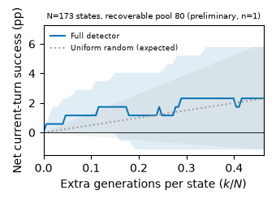

# RACER 恢复机制消融（BFCL Long Context · C2KV · B=256）

所有数字都来自 box9 上每个配置的一次 greedy 运行，状态是 **preliminary, n=1**。
差值按任务配对计算。95% 区间来自按任务重采样的 bootstrap（10000 次），只用来描述不确定性，不作为“实验成功或失败”的门槛。

## 结论

对照事先给定的结论表，逐条如下：

| 对照 | 观察 | 可以支持的结论 |
|---|---|---|
| M1 vs M2 | M2 相对 M1 为 −0.5pp [−3.5, +2.5]。只有一方成功的任务：M2 4 个，M1 5 个 | M1 没有优于 M2。在固定初始分配规则下，**这组数据不支持** post-draft recovery 带来闭环增量 |
| M1 vs M3 | M3 相对 M1 为 +0.5pp [−2.5, +3.5]，5 / 4 | 两者接近。**尚不能排除**一次额外自查就是主要解释，证据恢复的优势主张应收窄 |
| M1 vs M4 | M4 相对 M1 为 +0.5pp [0.0, +1.5]，1 / 0 | M1 没有优于 M4。held draft 的检索增量**没有得到支持** |
| 完整 detector vs random | 在 detector 自己会触发的 20 个状态上，完整 detector 为 +1.73pp，random 期望为 +0.58pp；两者区间重叠 | 方向与“更有效地分配恢复机会”一致，但可恢复池里只有 10 个状态改变了结果，**不足以支持**两者有差别 |
| 覆盖率 | 173 个可评分状态中，93 个没有可行的恢复候选 | 当前预算首先**受可恢复覆盖率限制**。曲线平坦不能拿来判定 detector 或 router 无用 |
| M0 vs M1 | M0 相对 M1 为 +1.0pp [0.0, +2.5]，2 / 0。这 2 题只有 M0 做对，而且都发生过 argument correction 改参 | M0 比 M1 多出的部分全部出现在 correction 改过参数的任务上。完整系统的收益不能全部归给 detector–recovery |
| 完整系统 vs 不恢复 | M0 相对 M2 为 +1.5pp [−1.5, +5.0]，7 / 4 | 这 1.5pp 里有 1.0pp 与 correction 对应 |

轻量 detector（draft NLL + `is_stop` + `parse_ok`）那条曲线**还没做**。原因和补做方法见最后一节。

## 设置

- **任务与评分：** BFCL Long Context 的全部 200 个官方任务，用官方 state/response checker 评分。
- **模型：** Qwen3-4B-Instruct-2507 actor 与 C1000 history checkpoint（config sha256 `15e14bfa…`）。
- **history：** C2KV history backend，ratio 8，history 容量 B = 256 tokens，tool definitions 保持原文。
- **生成：** greedy decoding，max_new_tokens 4096，每题最多 96 次生成调用，每个 decision 最多再生成一次。
- **detector：** 冻结的 T02 artifact（sha256 `18a11f73…`），阈值 0.5。
- **代码版本：** 所有行都跑同一个冻结版本，paper `9a88fed`（077559f 加上 4 个消融 variant），engine `b886b41`。
- **硬件：** box9，4 张 RTX 4090 48GB；每个配置切成 8 个 25 题的 shard。

| 行 | cell | 实现 |
|---|---|---|
| M0 | `racer_v2_c2kv_c1_v2_verified_b256` | 完整 RACER，含 source-verified argument correction |
| M1 | `racer_v2_c2kv_c1_v2_core_b256` | RACER-core：关闭 argument correction；再生成解析失败时仍回退到原 draft |
| M2 | `racer_v2_c2kv_c1_v2_verified_protected_off_b256` | 与 M1 相同的初始分配和容量 fallback，直接提交 draft |
| M3 | `racer_v2_c2kv_c1_v2_selfrev_b256` | 触发条件与恢复资格同 M1。本该恢复时，不给档案证据，而是在原上下文末尾追加一条 user 消息：冻结的自查提示、空行、原样的 draft 文本 |
| M4 | `racer_v2_c2kv_c1_v2_nodraftq_b256` | 同 M1，但检索 query 去掉 draft 文本、tool name、参数串和由参数派生的 exact anchors；只按当前请求和最新的完整 observation 重新筛选、排序 |
| P | `racer_v2_c2kv_c1_v2_probe_b256` | 冻结状态分支：目标 decision 之前与 M2 一致；在目标处记下真实风险分，只绕过阈值去做恢复，之后按 M2 策略继续 |

M3 追加的自查段计入实际 token 和 model-context 检查，不计入 history 容量。全部运行中，追加段总计 70636 tokens，没有一次触发 context 上限。

## 正文表：闭环消融

| 行 | 成功 / 200 | 成功率 | 相对 M1 (pp) [95% CI] | 只有该行成功 / 只有 M1 成功 | 方法容量失败 | harness 失败 | regenerations/decision | actor generations/task | 平均 history KV (tokens) |
|---|---|---|---|---|---|---|---|---|---|
| M1 RACER-core | 27 | 13.5% | — | — | 4 | 0 | 0.214 | 16.0 | 170.4 |
| M2 直接提交 draft | 26 | 13.0% | −0.5 [−3.5, +2.5] | 4 / 5 | 2 | 0 | 0.000 | 13.1 | 160.7 |
| M3 evidence-free self-revision | 28 | 14.0% | +0.5 [−2.5, +3.5] | 5 / 4 | 2 | 0 | 0.282 | 19.9 | 170.8 |
| M4 检索不用 draft | 28 | 14.0% | +0.5 [+0.0, +1.5] | 1 / 0 | 4 | 0 | 0.209 | 16.1 | 171.3 |

- **分母：** 始终是完整的 200 题。方法容量失败（`c2kv_capacity_infeasible`）按未完成任务计 0 分，并单列。
  - task 54 和 134 在所有配置里都失败；task 77 和 105 只在做恢复的配置（M0、M1、M4）里失败。
- **History KV：** 对所有完成的生成（包括 draft 和 regeneration）取“保留 history + 恢复证据”的 token 数再平均，取值来自每次生成前的预算回执。
  - 除上面 4 个方法失败的任务外，逐题与 `unified_metrics.active_history_kv` 完全一致；这 4 个任务的汇总字段为空，但已完成的生成仍计入均值。
- **计算量不能只看再生成率：** 闭环轨迹长度不同。M3 共 3105 个 decision（M1 为 2631），每题 prompt tokens 121423（M1 为 90561），所以调用率相近不代表总计算量相同。
- **敏感性（只看，不改结论）：** 只用与 detector 训练、校准 family 隔离的 174 题时，符号不变：M2 −1.1pp、M3 +1.1pp、M4 +0.6pp、M0 +1.1pp。

## 正文图：冻结状态上的恢复效用



- **抽样：** 从 M2 的轨迹里，对每个隔离任务取一个前缀有效的 draft 状态（`previous_turn_valid is True`，与 T02 口径相同）。
  - 均匀抽样，种子是 `racer-abl-20260924`，抽完即冻结，不重抽。targets 文件 sha256 为 `245561de…`。
- **标签：** Y⁰ 是 M2 在该 turn 的 current-turn success；Yᴿ 是 P 在同一 turn 的 current-turn success。
- **U(k)：** 可恢复池 F 按分数排序后，取前 k 个状态的 Δ = Yᴿ − Y⁰ 求和，再除以 N。阴影是按任务 bootstrap（2000 次）的 95% 区间。random 用解析期望，不做抽样。

| 覆盖项 | 数量 |
|---|---|
| 目标任务（与 detector 训练、校准 family 隔离） | 174 |
| 抽到状态 | 174 |
| P 运行完成 | 174 |
| 目标之前的 draft token 与 M2 逐步一致 | 174 |
| 两边都可评分（N） | 173（task 105 的 P 分支在目标所在 turn 发生容量终止，标签未定义） |
| P 在目标处完成一次额外生成（F） | 80 |

| k/N | 完整 detector U (pp) | random 期望 U (pp) |
|---|---|---|
| 0.116（k=20，即风险分 > 0.5 的状态） | +1.73 [0.00, +3.47] | +0.58 [−0.31, +1.57] |
| 0.231 | +1.16 | +1.16 |
| 0.347 | +2.31 | +1.73 |
| 0.462（always，F 全部干预） | +2.31 | +2.31 |

- **池内结果只改变了 10 个状态：** F 里 错→对 7、对→错 3、错→错 37、对→对 33。净增 4 个，落在完整 detector 排名前 20 的状态里就有 3 个。
- **覆盖主要卡在 turn 0：** turn 0 的 108 个可评分状态中，只有 16 个有可行候选；turn ≥ 1 的 65 个状态中有 64 个可行。turn 0 的状态本来就没有多少可恢复的档案。
- **补充指标（不代替曲线）：** 以 Y⁰ 失败为标签（失败率 96/173），完整 detector 的 AUROC 为 0.669，AP 为 0.735。
- **口径：** 这张图对应“任务均衡、前缀有效的决策状态”，不代表线上全部 decision 的分布，也不据此声称 detector 相比 random 提高了闭环整题成功率。

## 附录 A：M0 vs M1（argument correction）

| 行 | 成功 / 200 | 相对 M1 (pp) [95% CI] | 只有 M0 成功 / 只有 M1 成功 | correction 真正改变动作的 decision | 涉及任务 |
|---|---|---|---|---|---|
| M0 完整 RACER | 29 | +1.0 [0.0, +2.5] | 2 / 0 | 24 | 5 |
| M1 RACER-core | 27 | — | — | 0 | 0 |

- **correction 本身：** M0 中 correction 的 proposed、verified、changed 都是 24 次，全部出现在 recovery abstain 之后。
- **两组成功集合的差：** 只有 M0 做对的 2 题是 task 138 和 175，两题都发生过改参；没有只有 M1 做对的题。
- **不能直接算成“救回”：** “规则改过参数”不等于“这次改参救回了任务”。这两题都发生过改参，但本次没有逐步核对改参之后的轨迹差异，最终成败也可能受后续步骤影响。

## 附录 B：干预漏斗与成本

| 行 | decisions | 风险触发 | 无可行候选 | repack 可行 | 再生成完成 | 再生成动作被提交 | 解析失败回退 | 失败的 decision |
|---|---|---|---|---|---|---|---|---|
| M0 | 2623 | 674 | 121 | 553 | 553 | 553 | 0 | 4 |
| M1 | 2631 | 686 | 122 | 564 | 564 | 564 | 0 | 4 |
| M2 | 2628 | 0 | 0 | 0 | 0 | 0 | 0 | 2 |
| M3 | 3105 | 1003 | 126 | 877 | 877 | 870 | 7 | 2 |
| M4 | 2671 | 686 | 129 | 557 | 557 | 557 | 0 | 4 |

| 行 | prompt tokens/task | output tokens/task |
|---|---|---|
| M0 | 90075 | 1291 |
| M1 | 90561 | 1294 |
| M2 | 80422 | 1098 |
| M3 | 121423 | 1309 |
| M4 | 91246 | 1298 |

没有任何 decision 触碰每题 96 次的生成上限。

## 数据质量检查

- **确定性：** smoke 中 M2 同样 2 题重跑一次，46 个 decision 的 draft token 完全一致。全量中 P 在 174/174 个状态上逐步复现了 M2 的前缀。
  - 不在 F 里的状态，Δ 全部为 0。这相当于对整个 turn 做了一次确定性检查。
- **逐 turn 评分器：** 与官方整题分数对账，M2 的 164 个、P 的 147 个完整长度任务全部一致；其余是被 force-terminate 的任务，官方直接判错。
- **detector 分数：** 从 trace 离线重算的完整 detector 分数，与线上 gate 记录的差为 0。
- **失败与重跑：** 48 个 shard 全部 exit 0，没有重跑，也没有中途换代码版本。
- **测试：** 与 077559f 相比，现有测试套件没有新增失败；新加的 13 个针对性测试全部通过。

## 待补：轻量 detector

需要重新拟合轻量 detector，并用和完整 artifact 相同的 62 个训练样本、同样的分组、同样的 C 网格与 GroupKFold(3) log-loss 选择方式。所需的 T02 标签文件只存在 NPU 服务器上，即 T02 evidence-sets 工作目录下的 `prepared_v8/run/labels.json`（sha256 `ac605900…`，与 artifact provenance 记录的数据集相同）。

lyc-2 中转机从约 01:12Z 起离线，写报告时（约 07:10Z）文件仍拿不到。补做只需下面两步：

```bash
python -m racer_ablation.light_detector labels.json artifacts/c1_risk.t02_v1.json light.json
python -m racer_ablation.utility_curve /workspace/validation/bfcl probe_states.json light.json utility.json --m2 <M2 roots> --probe <P roots>
```

两步都是 CPU 任务，不需要再跑 GPU。第一步会先用同一份数据重新拟合完整 artifact，核对它复现冻结 artifact 的 content hash。

已知轻量 detector 的一个限制：训练集里 `parse_ok` 恒为 1（冻结 artifact 中该特征的权重为 0），所以它实际只有 NLL 和 `is_stop` 两个有效特征。

## 复现信息

- **代码：** fork 分支 `ablation/racer-mech-20260924`。运行版本为 `9a88fed`；后续提交 `25b49b9` 和 `a7cd122` 只改分析脚本，并加入结果文件。
- **原始输出：** `hf://buckets/Jasonning/c2kv-paper-202609/m9/` 下的 `results-abl-s0..7`（M0–M4）和 `results-ablp-s0..7`（P），48 个 cell 均已推送并校验；还有 `results-abl-analysis`。
- **分析产物：** 本目录的 `results_20260924/`，包括闭环表 JSON、冻结的 states/targets、效用曲线 JSON 和图。每个数字都由本包中的脚本从上述原始输出生成。
